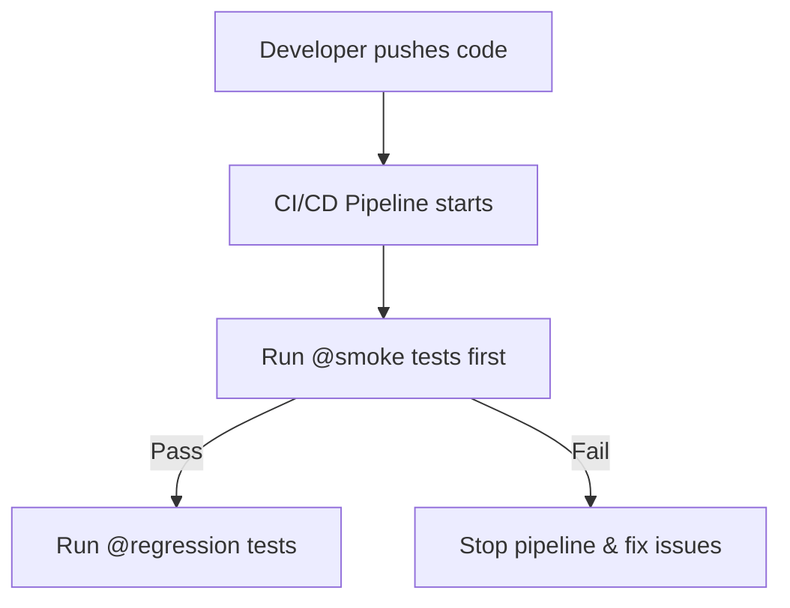

# 🚀 Playwright JavaScript Automation Testing Suite


> A complete **Playwright JavaScript** automation project for **The Internet (Heroku App)** and **OpenCart** — featuring **POM architecture**, **custom utilities**, **Axe accessibility checks**, and **CI/CD pipelines** for **Heroku** & **Docker**.

________________________________________
## 📚 Table of Contents
- [📂 Project Structure](#-project-structure)
- [✨ Features & Enhancements](#-features--enhancements)
- [🚀 Setup & Installation](#-setup--installation)
- [🔄 CI/CD Integration](#-cicd-integration)
- [🧪 Running Tests](#-running-tests)
- [📊 Reports & Screenshots](#-reports--screenshots)
- [🛠 Tech Stack](#-tech-stack)
- [👩‍💻 Author](#-author)
________________________________________
## 📂 Project Structure.
├── tests/
│   ├── internetapp/
│   │   ├── Basic_Interaction/
│   │   │   ├── checkboxes.spec.js
│   │   │   └── dynamic-loading.spec.js
│   │   └── Advanced_Interaction/
│   │       ├── dynamicControls.spec.js
│   │       └── infiniteScroll.spec.js
├── pages/
│   ├── base/
│   │   └── BasePage.js
│   └── internet/
│       ├── CheckboxesPage.js
│       ├── DynamicLoadingPage.js
│       ├── DynamicControlsPage.js
│       └── InfiniteScrollPage.js
├── playwright.config.js
└── package.json
•	tests/ – Contains all test files grouped by feature.
•	pages/ – Page Object Model files containing reusable functions.
•	playwright.config.js – Playwright configuration file.
________________________________________

## ✨ Features & Enhancements
- **✅ POM (Page Object Model)** – Clear separation of locators & test logic.
- **✅ Custom Utilities**
  - Retry logic for flaky steps
  - Wait helpers (`waitForEnabled`, `waitForVisible`, `waitForDetached`)
  - Popup handler for new browser windows/tabs
  - Logger for centralized test tracking
  - File helper for download directories
- **✅ Accessibility Testing** – WCAG 2.1 AA compliance checks with Axe.
- **✅ Execution Profiles** – Smoke, Regression, Full Suite.
- **✅ Cross-Browser Support** – Chromium, Firefox, WebKit.
- **✅ CI/CD Ready** – GitHub Actions with Heroku & Docker deployments.
_______________________________________
## 🚀 Setup & Installation

**1️⃣ Clone Repo**
```bash
git clone https://github.com/menahilnadeem08/Playwright-Test-automation
cd Playwright-Test-automation
```

**2️⃣ Install Dependencies**
```bash
npm install
```

**3️⃣ Run Tests**
```bash
npm run test:opencart:qa
npm run test:internetapp:dev
```

**4️⃣ View Report**
```bash
npx playwright show-report
```

---
_______________________________________
## 🔄 CI/CD Integration

**GitHub Secrets Required**
- `HEROKU_API_KEY`
- `HEROKU_APP_NAME`
- `DOCKERHUB_USERNAME`
- `DOCKERHUB_TOKEN`
________________________________________
## 🧪 Running Tests

| Command | Description |
|---------|-------------|
| `npm run test:opencart:qa` | Run OpenCart QA suite |
| `npm run test:internet:dev` | Run Internet app QA suite |
### 🔹 1. Smoke Tests
Run all tests annotated with **@smoke**:

**Using npm script (recommended):**
```bash
npm run test:smoke:dev
```

**Direct Playwright command:**
```bash
npx playwright test --grep "@smoke"
```
### 🔹 2. Regression Tests
Run all tests annotated with **@regression**:

**Using npm script (recommended):**
```bash
npm run test:regression:dev
```

**Direct Playwright command:**
```bash
npx playwright test --grep "@regression"
```

### 🔹 3. Multiple Tags
Run both smoke and regression tests:
```bash
npx playwright test --grep "@smoke|@regression"
```

---
_______________________________________

## 📊 Reports & Screenshots

**📄 Playwright HTML Report**
- Generated automatically after test execution.
- View locally by running:
```bash
npx playwright show-report
```
- Opens in your default browser on **http://localhost:9323**.

**♿ Accessibility Report**
- Generated for each accessibility test.
- Stored as **JSON files** in:  
```
reports/accessibility/*.json
```
- Contains details of any WCAG 2.1 AA violations.
________________________________________
Running Specific Tests
•	Run a single test file:
npx playwright test tests/internetapp/Basic_Interaction/checkboxes.spec.js
•	Run a specific test by name:
npx playwright test -g "Verify checkbox state changes and persistence"
•	Use test.only() in a test file to run only that test:
test.only('Test name', async ({ page }) => {
  // test code
});
____________________________________
Contributing
1.	Fork the repository.
2.	Create a new feature branch:
git checkout -b feature/YourFeature
3.	Commit your changes:
git commit -m "Add new feature"
4.	Push to your branch and open a Pull Request.
________________________________________
## 🛠 Tech Stack
- **Playwright** (JavaScript)
- **Node.js** (>= 16.x)
- **Axe-core** (Accessibility)
- **GitHub Actions** (CI/CD)
- **Docker** & **Heroku** (Deployment)
________________________________________
Architecture Decisions & Design Patterns
•	Page Object Model (POM): Each page has its own class with reusable methods.
•	Utility Functions: Common functions like waits, retries, and file handling are centralized.
•	Error Handling: Custom retry mechanisms and comprehensive logging for flaky elements.
•	Separation of Concerns: Tests, pages, and utilities are organized in separate folders.
_______________________________________

Notes
•	This project uses Page Object Model for maintainable and reusable test code.
•	Make sure you have a stable internet connection when running tests because the website is hosted on Herokuapp.
•	Adjust timeouts in playwright.config.js if tests fail due to slow loading:
use: {
  navigationTimeout: 60000,
  actionTimeout: 30000
}

This project uses **Playwright** for end-to-end test automation with support for **tag-based execution**  
(`@smoke` for quick checks, `@regression` for full coverage).

---

## 📌 Test Tags Overview

| Tag          | Purpose                                        | Typical Frequency |
|--------------|------------------------------------------------|-------------------|
| `@smoke`     | Critical-path tests to validate core features  | Every commit      |
| `@regression`| Comprehensive test coverage                    | Before release    |

## 📊 Test Execution Flow




## 👩‍💻 Author
**Menahil** – Software Engineer | QA Automation Engineer in Training  
📧 Email: menahilnadeem08@gmail.com  


